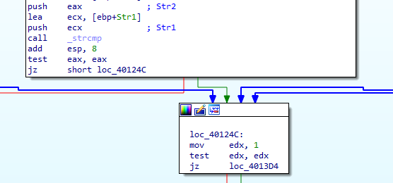
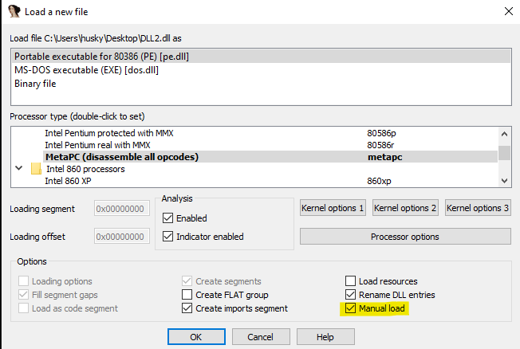
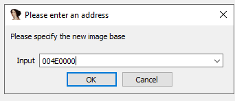

#  <span style="color:#004F98;">**Lab 9-1 :**</span>


 Analyze the malware found in the file Lab09-01.exe using x64dbg and IDA-Pro to answer the following questions. This malware was initially analyzed in 
the Chapter 3 labs using basic static and dynamic analysis techniques.

**Questions**
 1. How can you get this malware to install itself?
 2. What are the command-line options for this program? What is the password requirement?
 3. How can you use x64dbg to permanently patch this malware, so that it 
doesn’t require the special command-line password?
 4. What are the host-based indicators of this malware?
 5. What are the different actions this malware can be instructed to take via 
the network?
 6. Are there any useful network-based signatures for this malware?

___

From basic analysis we know that:
- It's a 32-bit PE 
- Console app
- MD5: B94AF4A4D4AF6EAC81FC135ABDA1C40C
- SHA256: 6AC06DFA543DCA43327D55A61D0AAED25F3C90CCE791E0555E3E306D47107859
- The binary deletes itself when double clicked.

**Now, let's open it in IDA.**

## **Overview**
At begining, we see a check for the number of command-line arguments, if it lower than '1' the progrm calls `sub_40100`, If it's greater then it calls `sub_402510`

**Note** argc must be greater than 0 as the file name of the program is always counted


`sub_40100` is calling `ShellExeuteA` function, but we don't know which are acutually pushed to it


We could use x64dbg and breaking on our functionto see what does the function do.


We can see that it uses cmd.exe to execute the following command:
```bat
 /c del C:\\Users\\husky\\Desktop\\Lab09-01.exe >> NUL
```
This command is used to delete the binary, that means that there is some command-line arguments that should be passed to make the binary works.


## **Reversing password**

The `sub_402510` function acts as a password checker, we see 5 comparison that must be satisfied in the last argument "password" so that the program runs.

After some debugging, We can obtain that the password is
<span style="color:#00F0FA;">**abcd**</span>. 


## **Bypassing password**

To patch the malware so that we could bybass the password we may turn every `je` to `jmp`.

An alternative way is that we could simply set eax to '1' then do a "**ret**" instruction like that:
```Assembly
B8 01 00 00 00   MOV EAX, 0x1
C3               RET
```


## **Malware options**

Beside the "**password**" there is another argument that specifies which option will be taken.


After the password checking, the malware compares between the second argument and `-in`, If it's true, the program starts to install itself.

We can find that the other options are being pushed to "mem_comp" function to be compared to our input argument one by one.

   

**Note:** *"-op1" is the input I used, the other argument to "mem_comp" is the hardcoded option.*

**The options  are:**

1. <span style="color:#00F0FA;">**-in**</span>, Installs the malware.
2. <span style="color:#00F0FA;">**-re**</span>, Removes the malware.
3. <span style="color:#00F0FA;">**-c**</span>, Preforms a post-compromise activity.
4. <span style="color:#00F0FA;">**-cc**</span>, Checks current configuration in registry key.

<span style="color:#00F0FA;">**For self installation,**</span> we have to run the malware with 2 arguments "<span style="color:#00F0FA;">**-in**</span>" and "<span style="color:#00F0FA;">**abcd**</span>".

 ## **Host-base IOCs**
-  The registry key used to store the malware configuration: <span style="color:#00F0FA;">**HKLM\SOFTWARE\Microsoft \XPS**</span>.

- The service created  the name: "<span style="color:#00F0FA;">**Manager Service**</span>."

- The presence of a binary at <span style="color:#00F0FA">**%SYSTEMROOT%\Windows\System32**</span>.

## **Network actions**
By using IDA strings, we can notice some actions that belongs to a connection to the network in the `sub_402020`, these actions are:

- NOTHING, does nothing
- DOWNLOAD, uploads a file from disk to a web resource.
- UPLOAD, downloads a file from a web resource over a specified port and write it to disk
- SLEEP, puts the malware to sleep for a some milliseconds


**Note**: *for upload and download actions, these aren't types, The **upload** action is  downloading to the host, and the **download** action is uploading to a remote host.*


 ## **Network-base IOCs**

- `http://www.practicalmalwareanalysis.com` using **HTTP/1.0**

___
___


# <span style="color:#004F98;">**Lab 9-2 :**</span>

Analyze the malware found in the file Lab09-02.exe using x64dbg to answer 
the following questions.

 Questions
 1. What strings do you see statically in the binary?
 2. What happens when you run this binary?
 3. How can you get this sample to run its malicious payload?
 4. What is happening at 0x00401133?
 5. What arguments are being passed to subroutine 0x00401089?
 6. What domain name does this malware use?
 7. What encoding routine is being used to obfuscate the domain name?
 8. What is the significance of the CreateProcessA call at 0x0040106E?
 ___

From basic analysis we know that:
- It's a 32-bit PE 
- GUI app
- MD5: 251F4D0CAF6EADAE453488F9C9C0EA95
- SHA256: F153DFACEC09DD69809C3BBF68270A38EE3701F44220C7BF181C14A68C138133
- The binary terminates itself when double clicked.

## **Exploring strings**
First let's look at strings using **Floss**:

Besides the list of importd APIs, there are no interesting strings that 
appear statically in the binary, but floss was able to gather some  decoded strings and stackstrings


**Now, let's open it in IDA.**


First, we see some values being stored in the stack segment which are corresponding to our previously mentioned stackstrings.

This is a common string obfuscation technique to make analysis more challenging.

 

A while after a call to `_strcmp` function which compares between 2 arguments `str1` and `str2`.



Using x64dbg we can see that the two arguments are `ocl.exe` and `Lab09-02.exe`


If the comparison is true, return value will be '0' and the malware starts it functionality, If false, the the return value is '1' and the malware will terminate itself.

So, <span style="color:#00F0FA;">**To run the malicious payload**</span>, we could change file name to become `ocl.exe`.

After that, we see a call to `WSAStartup` and `WSASocketA` to initiates a socket conection, then a call to `sub_401089.

Using x64dbg, we can see that the 2 arguments that are pushed to `sub_401089` are "<span style="color:#00F0FA;">**0x019FD40**</span>"  and "<span style="color:#00F0FA;">**1qaz2wsx3edc**</span>".


The `sub_401089` acts as a decoding routine to decode the `1qaz2wsx3edc` and store the result in memory at "**0x019FD40**" , the decoded string is a domain name called `http://www.practicalmalwareanalysis.com`.


      


The encoding routine used to obfuscate the domain name is a <span style="color:#00F0FA;">**XOR**</span> routine.

After that we see a call to `gethostbyname` and `htons` to establish the network to a `connect` API call, If the connection with C2 server was successful, the malware calls `sub_401000`.

Inside the `sub_401000`, we see a called to `CreateProcessA` API to creates a new process and its primary thread.

According to [MSDN Page](https://learn.microsoft.com/en-us/windows/win32/api/processthreadsapi/nf-processthreadsapi-createprocessa) the parameters to the `CreateProcessA` enables it to creates a new process with the `cmd.exe` command line to be executed in a hidden window.

The standard input, output, and error streams are passed to the established socket to the C2.

 

## <span style="color:#00F0FA;">**Summary**</span>

The malware acts as a Reverse-Shell allowing access to this host, and then establishes a cmd process to receive commands to execute from a C2 server.

___
___


#  <span style="color:#004F98;">**Lab 9-3 :**</span>
 Analyze the malware found in the file Lab09-03.exe using x64dbg and IDA-Pro. 
This malware loads three included DLLs (DLL1.dll, DLL2.dll, and DLL3.dll) 
that are all built to request the same memory load location. Therefore, when 
viewing these DLLs in x64dbg versus IDA Pro, code may appear at different 
memory locations. The purpose of this lab is to make you comfortable with 
finding the correct location of code within IDA Pro when you are looking at 
code in x64dbg.

 Questions
 1. What DLLs are imported by Lab09-03.exe?
 2. What is the base address requested by DLL1.dll, DLL2.dll, and DLL3.dll?
 3. When you use x64dbg to debug Lab09-03.exe, what is the assigned based 
address for: DLL1.dll, DLL2.dll, and DLL3.dll?
 4. When Lab09-03.exe calls an import function from DLL1.dll, what does 
this import function do?
 5. When Lab09-03.exe calls WriteFile, what is the filename it writes to?
 6. When Lab09-03.exe creates a job using NetScheduleJobAdd, where does it get 
the data for the second parameter?
 7. While running or debugging the program, you will see that it prints out 
three pieces of mystery data. What are the following: DLL 1 mystery 
data 1, DLL 2 mystery data 2, and DLL 3 mystery data 3?
 8. How can you load DLL2.dll into IDA Pro so that it matches the load 
address used by x64dbg?

___

From basic analysis we know that:
- It's a 32-bit PE 
- Console app
- MD5: A90B5A068EF610C44F07ABEDDAB37D2A
- SHA256: 1FC6A471B2A46CD882246D5BDC9D5954BF8EFACF68B4E549A9756E6616848884
- The binary prints some mysterious strings when double clicked.

**Now, let's open it in IDA.**
___

In imports window, we can see that the binary imports the following DLLs:


Using **CFF Explorer**, we can see the that all three DLLs request the base-address of `0x10000000`.


In x64dbg, we can go to **Symbols** window to see that the assigned based-addresses of the three DLLs are loaded as following:


**NOTE that:** *DLL3.dll is dynamicly linked which means that we have to execute the **LoadLibraryA** function first to be able to see where it's been loaded.*

Now let's see what is happening in **main** function, first we see a call to `DLL1Print` function which is imported from **DLL1.dll**.


To see what it does, we step into it in x64dbg, we see that it calls only one function that prints it's two parameters `DLL 1 mystery data %d` the number at the end is the second parameter which is the value in the address of `0x10008030`.


As there is previous initialization to the value in the address of `0x10008030`, then it must had been initialize in **DLLMain** so let's go to it, we see that it is the ID of our current process `Lab09-03.exe`.


To make sure that we are right, We open `Process Hacker` to see that the ID of our current process `Lab09-03.exe` is the same to the printed number.

 


Now, let's get back to **main**:

After the **DLL1Print** we find a call to `DLL2Print`, We step into it to see the same function the was implemented in DLL1Print which will print `DLL 2 mystery data %d`, so we go to DLLMain to see the value in the second parameter.


We see a call to `CreateFileA` to create a file under the name of `temp.txt`, which means that it will return an open handle to the specified file, which will be printed to our output later.


To make sure of that, We open the **Handles** window to see the handel for the `temp.txt` is `EC` (236 in decimal) which to equivalent to our output.

 

Backing to **main** we see a call to `DLL3Print` which will also print `DLL 3 mystery data %d`, this time the seconed parameter refers to the Memory address of `ping www.malwareanalysisbook.com` which is equivalent to the our output (the parameter in hex and the output is decimal).

 

After that we see a call to `GetProcAddress` and `DLL3GetStructure` then a call to `NetScheduleJobAdd`.

According to [MSDN Page](https://learn.microsoft.com/en-us/windows/win32/api/lmat/nf-lmat-netschedulejobadd), The `NetScheduleJobAdd` is used to  submits a job to run at a specified future time and date, it takes 3 parameters:
- Servername
- Buffer
- JobId


The second parameter `buffer` gets it's data from the `DLL3GetStructure` return value, which represents a pointer to an AT_INFO structure describing the job to submit.

We can load DLL2.dll into IDA Pro in a different location by checking the 
Manual Load box when loading the DLL. In the field that says Please specify 
the new image base, we type `0x04E0000`.

 



___
___

**<p align="center"><span style="color:#00FFFF;">THE END</span></p>**


___
___